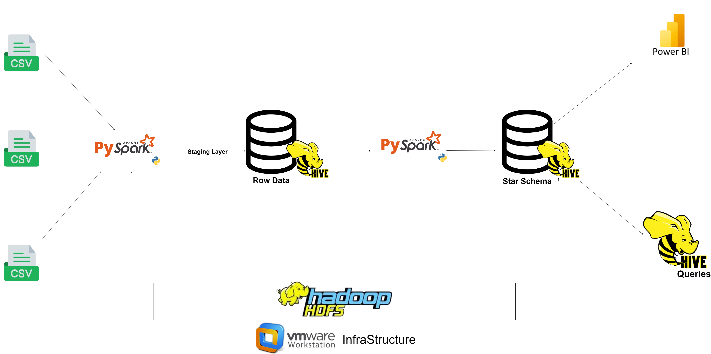
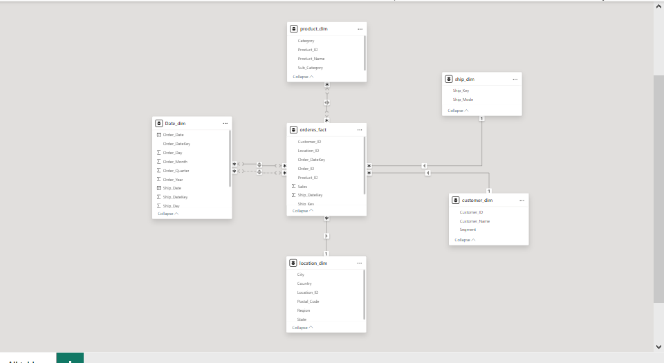
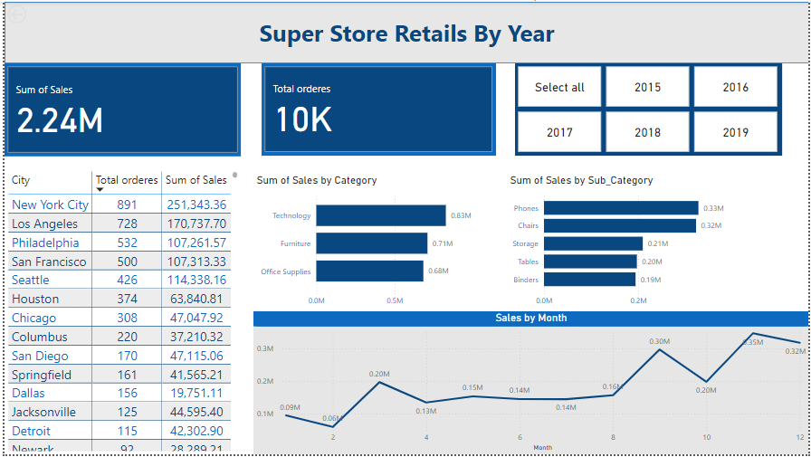

# Retail Data Pipeline & Analysis Project
This project is a data engineering pipeline that processes and analyzes retail sales data. The pipeline integrates data from three CSV files into a staging layer in Hive, where it is transformed and modeled into a data warehouse using a star schema. The processed data provides insights into sales trends, customer behavior, and product performance, which are further analyzed using Hive queries and visualized through Power BI.

## Tech Stack & Tools

- **Infrastructure:** VMware Workstation & Apache Hadoop
- **Data Sources:** CSV files
- **Staging Layer:** Hive (Denormalized format)
- **Data Warehouse:** Hive (Star Schema format)
- **Data Processing:** Apache Hive & PySpark
- **ETL:** Jupyter & Pyspark
- **Data Analysis:** Hive Queries
- **Data Visualization:** Power BI

## Pipeline Overview
The Retail Data Pipeline processes retail sales data extracted from three separate CSV files. The data is first ingested into a Hive table in a denormalized format, serving as the staging layer.

Next, the data undergoes transformations and modeling before being loaded into a data warehouse (DWH) structured in a star schema format within a separate Hive database.

Finally, comprehensive data analysis is conducted using Hive queries, and the results are visualized in Power BI to provide key insights into sales trends, customer behavior, and product performance.

## Data Extraction from CSV Files

In this project, retail sales data is extracted from three separate CSV files. Each file contains valuable information needed for our analysis.

The data is loaded into a **Hive table** in a denormalized format, which serves as a staging area for further processing.

## Transformation and Loading into the Data Warehouse

Once extracted, the data undergoes several transformation steps to ensure it is clean and ready for analysis. These transformations include:

- Standardizing data formats
- Calculating important metrics
- Removing duplicate records
- Structuring the data into a star schema for better query performance

After transformation, the data is loaded into a **Hive data warehouse**, which is designed to support complex queries and facilitate reporting and visualization in **Power BI**.

## Star Schema Overview

The Star Schema employed in our data warehouse enables efficient and straightforward queries across various dimensions related to retail sales. This design facilitates insightful analysis of sales performance, product categories, customer segments, and order fulfillment processes.

### Fact Table:

- **FactOrders:** Contains information about sales, including the total sales amount for each order. This table serves as the central point of our schema, allowing for detailed sales analysis.

### Dimension Tables:

- **DimProduct:** Contains information about products, including categories and subcategories. This dimension helps analyze sales performance by product type and facilitates inventory management.

- **DimCustomer:** Holds customer information, including demographics and segments. This allows for segmentation analysis, enabling targeted marketing and customer relationship management.

- **DimLocation:** Provides details about the location where orders were placed, including country, city, and region. This dimension supports geographical sales analysis and helps identify regional trends.

- **DimShip:** Details how orders have been shipped to customers, including various shipping modes. This dimension is crucial for understanding shipping performance and customer satisfaction.

- **DimDate:** Offers a comprehensive view of order dates and shipping dates, organized by day, month, quarter, and year. This facilitates time-series analysis and trend identification in sales patterns.

The relationships between these tables create a robust framework for analyzing retail sales data, providing insights into product performance, customer behavior, and order fulfillment efficiency. This star schema serves as the backbone of our data-driven decision-making processes and is integral to generating analytical reports in **Power BI**.

## Data Analysis Using HiveQL

Here, we focused on extracting valuable insights from the processed retail sales data stored in our Hive tables. Utilizing HiveQL, we executed a series of SQL queries to analyze key performance indicators, customer behaviors, and product trends. This analysis was essential for understanding the effectiveness of our sales strategies and identifying areas for improvement.

### Insights from SQL Queries

The following insights were derived from the analysis:

1. **Total Sales by Segment**: This analysis revealed the total sales generated by different customer segments, highlighting which segments contribute most significantly to overall revenue.

2. **Region-Wise Sales Distribution**: We identified the top five regions contributing to total sales, allowing us to pinpoint geographical areas of strength and potential for growth.

3. **Top 5 Cities by Total Sales**: This query showed the top-performing cities in terms of total sales, indicating where our highest sales volume occurs and where targeted marketing efforts might be most effective.

4. **Top 5 Cities with the Highest Number of Orders**: By examining the number of orders by city, we gained insights into customer engagement and order frequency, highlighting cities with strong purchasing activity.

5. **Top 5 Customers with Highest Sales**: This analysis showcased our highest-spending customers along with their segments, providing an opportunity for targeted promotions and customer loyalty initiatives.

6. **Customer with the Highest Sales in Each Segment**: By identifying the highest-selling customer in each segment, we can focus on strengthening relationships with key customers, potentially improving retention and sales.

7. **Top-Selling Category for Each Customer Segment**: This query highlighted the most popular product categories within each customer segment, allowing for tailored marketing strategies based on customer preferences.

8. **Top 10 Customers by Purchase Frequency**: This analysis revealed our most frequent customers, providing insights into customer loyalty and opportunities for engagement.

9. **Orders by Ship Mode**: This query analyzed the distribution of orders across different shipping methods, helping us understand shipping preferences and customer choices.

10. **Shipping Performance Analysis**: By examining average shipping times based on ship modes, we identified opportunities to improve shipping efficiency and enhance customer satisfaction.

## Data Visualization using PowerBI

In this phase, we focused on creating interactive dashboards using Power BI to present the insights gained from our data analysis. These dashboards provide a user-friendly interface for stakeholders to explore key metrics, trends, and patterns in retail sales data, enabling informed decision-making.

### Dashboards Overview ✨✨

1. **Retail Sales Overview**
   - **Total Sales**: $2.24M
   - **Total Orders**: 10K
   - **Key Visualizations**:
     - **Sales by City**: Bar chart displaying total sales for the top cities, with New York contributing $1.3M.
     - **Sales by Category**: Tree map showing the breakdown of sales across major categories, with Technology leading at $1.2M.
     - **Sales Over Time**: Line chart visualizing sales trends from January 2018 to December 2020, revealing seasonal peaks during holiday periods.
     - **Top Customers**: List of top customers based on total sales, with the highest spender contributing $110,000.

2. **Customer Segmentation Analysis**
   - **Total Customers**: 9,587
   - **Customer Segments**:
     - **Consumer**: 50.1% of total sales ($1.12M)
     - **Corporate**: 30.4% of total sales ($0.68M)
     - **Home Office**: 19.5% of total sales ($0.44M)
   - **Key Visualizations**:
     - **Sales by Segment**: Pie chart showing the distribution of sales among different customer segments.
     - **Sales by Region**: Bar chart illustrating sales performance across various regions, with the West leading in total sales.
     - **Average Order Value**: Comparison chart displaying average order value for each customer segment.

3. **Product Performance Analysis**
   - **Top Product Categories**:
     - **Technology**: $1.2M in total sales
     - **Furniture**: $0.8M in total sales
     - **Office Supplies**: $0.4M in total sales
   - **Key Visualizations**:
     - **Top Products**: Bar chart displaying top-selling products, with the "Apple MacBook" leading the sales.
     - **Sales by Sub-Category**: Stacked bar chart showing total sales for each sub-category, highlighting "Phones" and "Chairs" as top sellers.
     - **Shipping Method Analysis**: Pie chart indicating the distribution of orders by shipping method, showing "Standard Class" as the most popular choice.

This combination of visualizations not only makes the data easily accessible but also empowers stakeholders to make data-driven decisions to enhance sales strategies and optimize operations.
